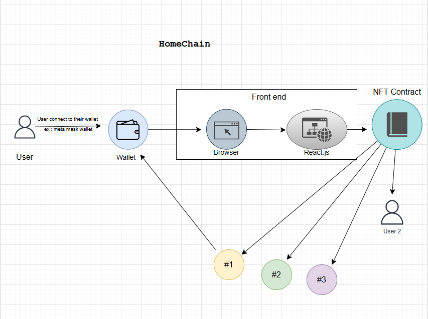

# Decentralized Systems and Applications Projects

## Overview  
This repository contains the projects I completed for the **Decentralized Systems and Applications** course during the **Fall 2025** semester at **MSKU University**.  
Each project demonstrates concepts such as blockchain architecture, smart contracts, and decentralized application (DApp) development.

---

## Projects Included  
1. **Solidity Basics**
   - this folder Contains basics of solidity language to write smart contracts!
3. **project1** : Hotel Room reservation smart contract : user can book a room and pay ether crypto Currency (in this smart contract 2 ether is the cost)! then the room becomes occupied.
   - Important Note: (remix.ethereum.org) is used to compile and deploy this project
5. **project2** : HomeChain :
   - Important Note: 
Real Estate App like Zillow, Zillow is a giant online catalog of homes. (IN-PROGRESS)

- General Model:
  
   
- Block Chain Architecture :
  
  

- How the System works?
  

---

⭐ *Feel free to explore, fork, or contribute to these projects!*
